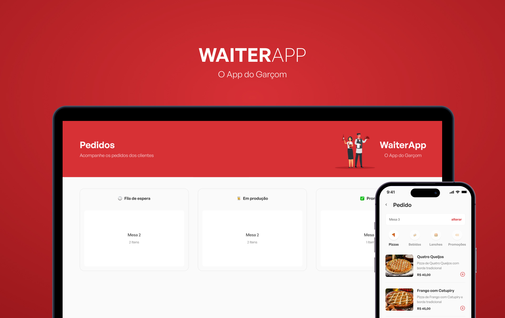

<div align="center"> 
  
</div>

## 🧑‍💻 Projeto 
  
 Na aplicação MOBILE os garçons podem cadastrar novas mesas e seus respectivos pedidos, na WEB o gerenciamento desses pedidos podendo modificar seu status.

<div align="center"> 
  
</div>


### ⚙ Pré-requisitos

Antes de começar, você vai precisar ter instalado em sua máquina as seguintes ferramentas:
[Git](https://git-scm.com), [Node.js](https://nodejs.org/en/),[Expo](https://docs.expo.dev/), [MongoDB](https://www.mongodb.com/)
Além disto é bom ter um editor para trabalhar com o código como [VSCode](https://code.visualstudio.com/).


### 📗 Rodando a Aplicação

```bash
📗 Installation

# Clone este repositório
$ git clone https://github.com/vidaaal/waiterapp.git

# Instale as dependências em Server, Mobile e Web
$ yarn ou npm install

# Execute a aplicação SERVER e WEB com
$ yarn dev ou npm run dev

# Execute a aplicação MOBIlE
$ npx expo start


```


## 🚀 Bibliotecas usadas

### Front-end 
* React
* Vite
* ReactNative
* Expo
* TypesScript
* Styled-Components

### Back-end
*  Node
*  MongoDB

### Mobile
*  React-Native
*  Expo
